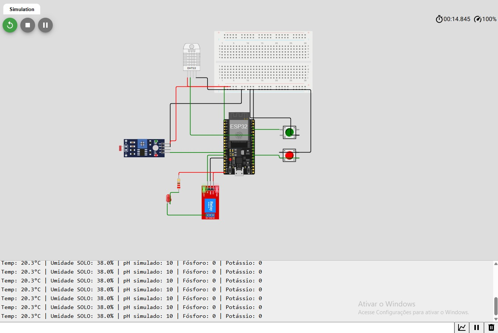
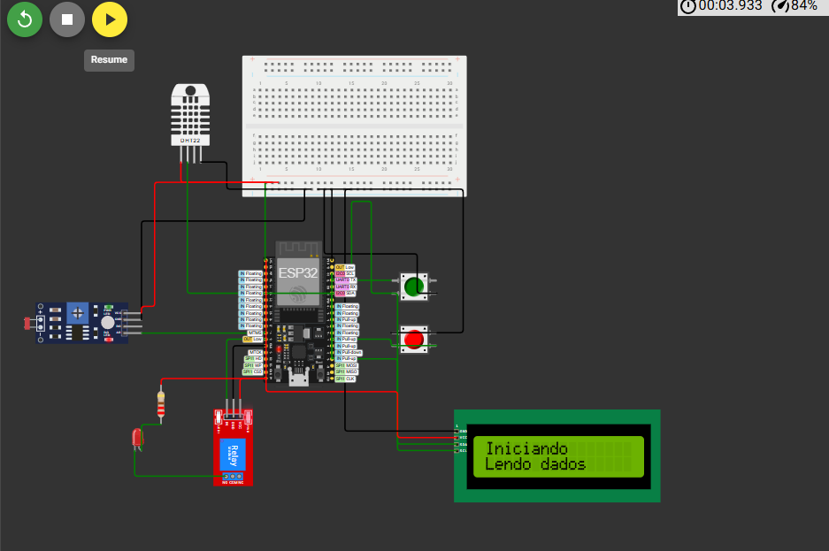
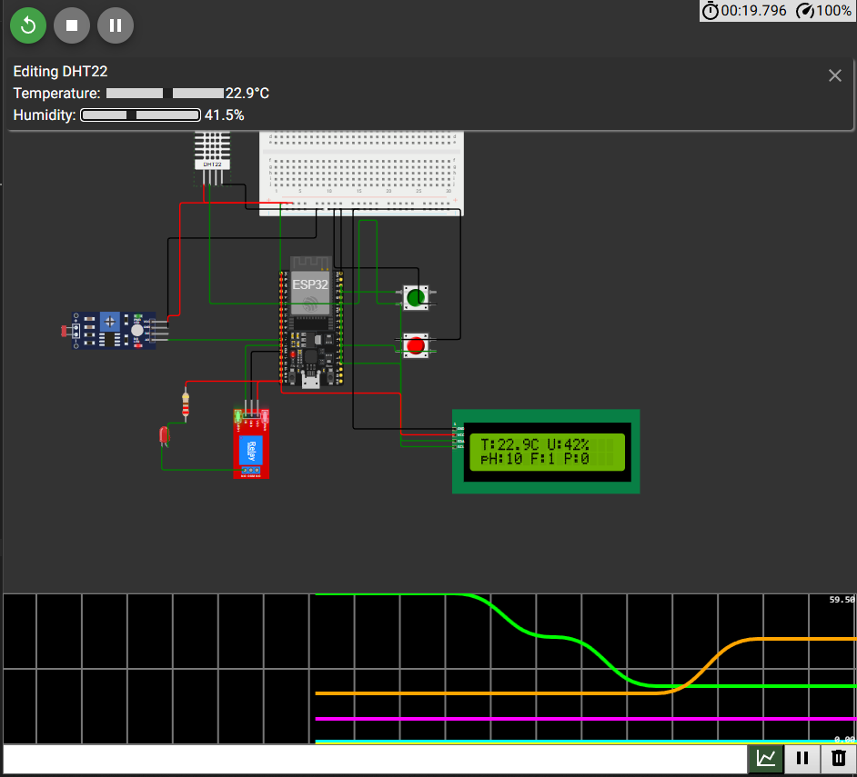
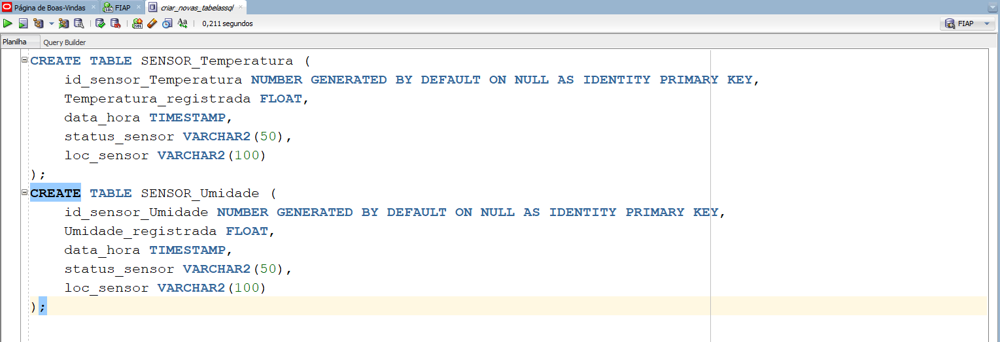
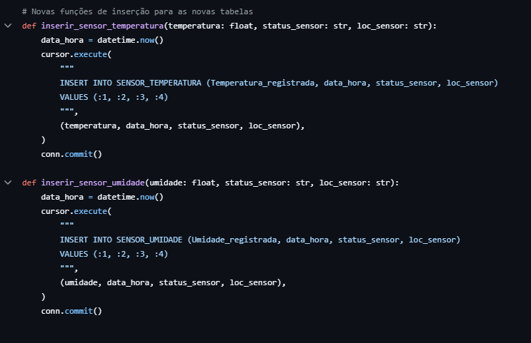
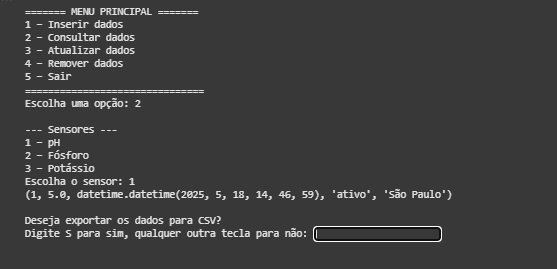

# FIAP - Faculdade de Informática e Administração Paulista

 

# Cap 1 - Construindo uma Máquina Agrícola

|        Grupo             |                   RM                   |
|:------------------------:|:--------------------------------------:|
| **Arthur Luiz Rosado Alves** | RM562061                          |
| **Renan de Oliveira Mendes** | RM563145                          |

# Sensores

Nessa Fase 4, aprimoramos nosso sensores. Adicionamos um display LCD, para mostrar em tempo real os valores lidos.
Utilizamos o Serial Plotter para visualizar graficamente de forma rápida os valores, diretamente de nosso sistema físico.
Melhoramos a performance de memória de nosso ESP32, utilizando váriaves com tipos especificos e mais precisos para cada utilização.

Nossa aplicação na fase anterior:

</a>

## Display LCD
Adicionamos um display LCD 16x2, barramento I2C (pinos SDA e SCL), para exibir os dados captados de Temperatura, Umidade, pH, Fósforo e Potássio.
Dessa forma o usuário consegue ter um feedback em tempo real no local de operação, por meio de uma interface simples.

</a>

## Serial Plotter
Também implementamos o uso de Serial Plotter para disponibilizar uma análise gráfica para o operador ou usuário.

</a>

## Otimização
Otimizamos nosso código C, realizando a alteração do tipo de algumas variáveis, utilizando int16_t e unit8_t para economizar memória e melhorar o desempenho.

</a>

# Banco de Dados
Aprimoramos nosso banco de dados, adicionando novas tabelas, melhorando o código e permitindo novas funcionalidades.

## Novas Tabelas
Adicionamos duas novas tabelas: Temperatura e Umidade.

</a>

## Novas Funcionalidades
Atualizamos nossa aplicação CRUD para permitir a manipulação de dados considerando as novas tabelas.
Adicionamos também uma nova funcionalidade que permite exportar um arquivo csv com os dados de determinado sensor.

</a>

</a>

</a>

# Análise e Predição com Streamlit

## Simulando Dados

## Análise Exploratória

## Modelo de Predição com Scikit-learn

